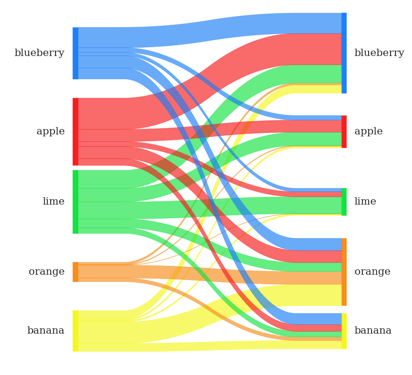

# pySankey

Uses matplotlib to create the kind of <a href="https://en.wikipedia.org/wiki/Sankey_diagram">Sankey diagrams</a> that I need.

Requires seaborn, pandas, numPy, matplotlib.


```python
import sankey
import numpy as np
import matplotlib.pyplot as plt
import pandas as pd
pd.options.display.max_rows=8
%matplotlib inline
```


```python
df = pd.read_csv('./fruits2.txt',sep = ' ',names=['true','predicted'])
```


```python
df
```


<div>
<table border="1" class="dataframe">
  <thead>
    <tr style="text-align: right;">
      <th></th>
      <th>true</th>
      <th>predicted</th>
    </tr>
  </thead>
  <tbody>
    <tr>
      <th>0</th>
      <td>blueberry</td>
      <td>orange</td>
    </tr>
    <tr>
      <th>1</th>
      <td>lime</td>
      <td>orange</td>
    </tr>
    <tr>
      <th>2</th>
      <td>blueberry</td>
      <td>lime</td>
    </tr>
    <tr>
      <th>3</th>
      <td>apple</td>
      <td>orange</td>
    </tr>
    <tr>
      <th>...</th>
      <td>...</td>
      <td>...</td>
    </tr>
    <tr>
      <th>996</th>
      <td>lime</td>
      <td>orange</td>
    </tr>
    <tr>
      <th>997</th>
      <td>blueberry</td>
      <td>orange</td>
    </tr>
    <tr>
      <th>998</th>
      <td>orange</td>
      <td>banana</td>
    </tr>
    <tr>
      <th>999</th>
      <td>apple</td>
      <td>lime</td>
    </tr>
  </tbody>
</table>
<p>1000 rows × 2 columns</p>
</div>


```python
colorDict =  {'apple':'#f71b1b','blueberry':'#1b7ef7','banana':'#f3f71b','lime':'#12e23f','orange':'#f78c1b'}
```


```python
sankey.sankey(df['true'],df['predicted'],aspect=20,colorDict=colorDict,fontsize=10)
plt.gcf().set_size_inches(6,6)
plt.savefig('fruit.png',bbox_inches='tight',dpi=150)
```



